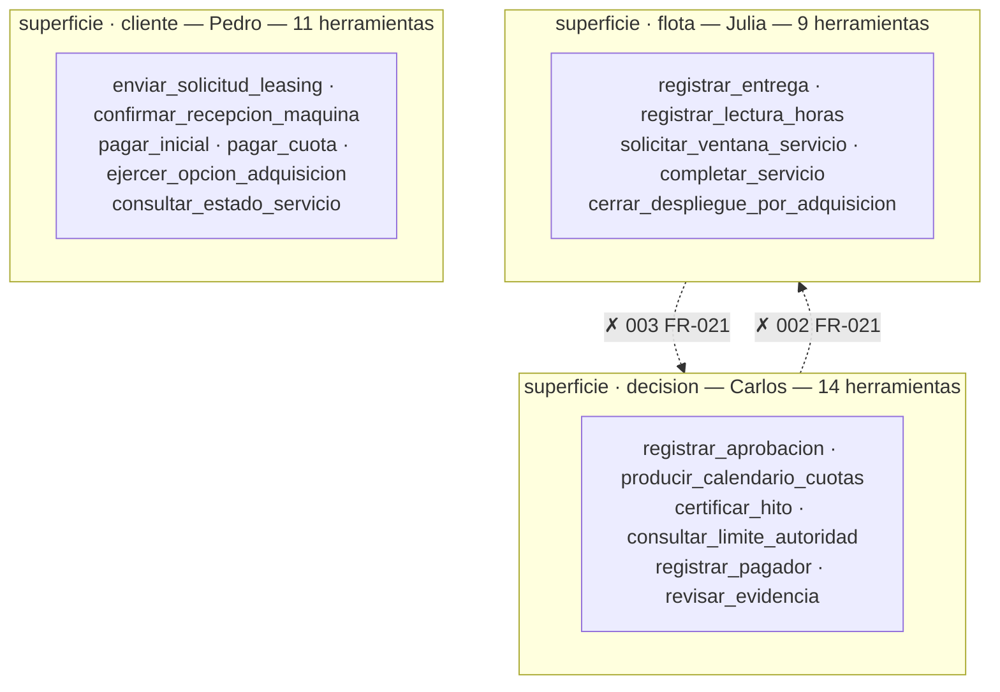
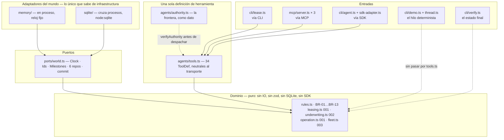
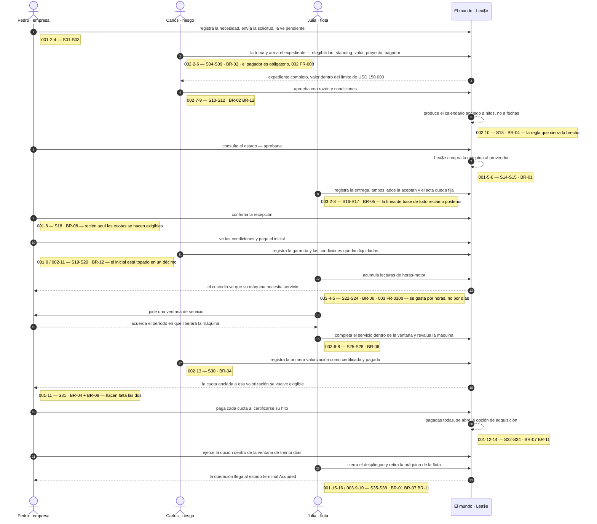

# Arquitectura — Lea$e

Cuatro vistas. Cada una responde una pregunta que ninguna otra responde.

| Vista | Pregunta |
|---|---|
| [V1 · Contexto de negocio](#v1--contexto-de-negocio) | ¿Quién es quién alrededor de Lea$e, y qué se mueve entre ellos? |
| [V2 · Frontera de autoridad](#v2--frontera-de-autoridad) | ¿Quién puede hacer qué, y por qué no puede hacer lo otro? |
| [V3 · Capas y transportes](#v3--capas-y-transportes) | ¿Cómo está construido, y qué sobrevive a un cambio de infraestructura? |
| [V4 · Stage 1 corriendo](#v4--stage-1-corriendo) | ¿Esto funciona de punta a punta? |

## Qué afirma este documento, y qué no

Afirma **una sola cosa: dónde están las fronteras y por qué están ahí.**

No redefine reglas de negocio —las cita a [`business-rules.md`](../business-rules.md)—, no dice qué
hace el sistema —eso es [`specs/`](../specs/), el único documento con autoridad sobre eso
(Principio IV)— y no explica cómo correr el POC —eso es [`poc/README.md`](../poc/README.md).

Es el **design record** que el Principio I nombra y nunca ubica:

> *No architecture decision, component boundary, diagram, or line of POC code may be produced before
> the requirement it serves exists in the spec chain.* […] *A queue, a cloud product, or a topology
> named inside a requirement is a design decision in disguise: it is moved to the **design record**,
> not deleted.*

De ahí sale la regla de redacción de este archivo: **cada caja y cada flecha cita el `FR-nnn` o el
`BR-nn` que la manda.** Un elemento sin cita es un defecto, no un adorno. Al pie está
[cómo comprobarlo](#cómo-se-verifica-este-documento) sin creerle a nadie.

---

## V1 · Contexto de negocio

El enunciado trae dos diagramas hechos a mano
([1](lab-02-diagram-1-request-purchase.png), [2](lab-02-diagram-2-delivery-payment-acquisition.png))
con tres actores y seis flechas. Las seis están abajo, numeradas. **La séptima no está en el
enunciado, y es el aporte de esta vista.**


| # | Quién a quién | Qué | Lo manda |
|---|---|---|---|
| 1 | Empresa → Proveedor | solicita maquinaria | `001` FR-001 |
| 2 | Empresa → Lea$e | solicita financiamiento | `001` FR-002 |
| 3 | Lea$e → Proveedor | compra el equipo — y se queda dueña | **BR-01** |
| 4 | Proveedor → Empresa | entrega el equipo | `003` FR-001 · **BR-05** |
| 5 | Empresa → Lea$e | confirma recepción | `001` FR-008 · **BR-08** |
| 6 | Empresa → Lea$e | paga cuotas | `001` FR-012 · **BR-04** |
| 7 | Empresa → Lea$e | ejerce la opción al pagarlas todas | `001` FR-017 · **BR-07** |
| **7bis** | **Pagador → Proyecto** | **certifica y paga la valorización** | **BR-04** · `002` FR-007, FR-008 |
| — | Proyecto ⇢ Lea$e | la certificación del hito hace exigible la cuota anclada a él | `002` FR-014 · `001` FR-010b |

Las siete primeras son las del enunciado. **La 7bis no está ahí, y es el aporte de esta vista.**

**La flecha que falta en el enunciado.** El brief dibuja tres actores; la arquitectura necesita un
cuarto. Si las cuotas vencen contra la certificación de la obra (**BR-04**), entonces el repago no
depende del solicitante sino de **quien le paga al solicitante** — el `Payer`. Por eso `002` FR-008
lo hace obligatorio: un pagador sin nombrar bloquea la decisión, aunque su comportamiento de pago se
registre como desconocido. Es la tensión que define a Carlos en
[`personas/Carlos.MD`](../personas/Carlos.MD): *«He is underwriting two companies and only has a
file on one»*.

Sin esa flecha, **BR-04 no tiene de dónde colgarse**, y el sistema vuelve a ser el CRUD de leasing
que el Principio III prohíbe: uno que administra contratos competentemente y nunca toca la razón por
la que el cliente no podía pagar por adelantado.

**BR-03 no es una integración, es una restricción.** Lea$e no es banco, financiera, cooperativa
registrada ni empresa inscrita en el registro SBS de arrendamiento, así que el régimen del D.L. 299
está cerrado. Eso no impide que un arriendo comercial termine en adquisición —es estipulación
civil—, pero fija la forma del contrato. Por eso está catalogada y **no aparece entre las reglas que
el código ejerce**: gobierna bajo qué régimen se contrata, no un comportamiento del sistema.

---

## V2 · Frontera de autoridad

La tesis arquitectónica del proyecto. La separación de funciones no es un comentario ni una
convención de equipo: es un **invariante que CI ejecuta en cada push**.



| Cruce | Qué queda prohibido | Lo prohíbe |
|---|---|---|
| Carlos → `flota` | no ve `registrar_entrega` ni `cerrar_despliegue_por_adquisicion` — *decidir prestar y prestar no pueden ser el acto de la misma persona* | `002` FR-021 |
| Julia → `decision` | no ve `registrar_aprobacion` ni `pagar_cuota` — *ella ejecuta sobre la máquina; nunca decide que un cliente dejó de pagar* | `003` FR-021 |

`cliente` no aparece en ningún cruce prohibido, y no es un olvido: **`cliente` no es una superficie de
Lea$e.** La línea que las specs prohíben cruzar corre por dentro de la empresa, entre decidir y
ejecutar.

### La misma línea, en tres capas

| Capa | Cómo se sostiene | Dónde |
|---|---|---|
| **Dominio** | Por **ausencia**: `underwriting.ts` no exporta nada que toque la flota, `fleet.ts` nada que decida una operación | [`poc/src/domain/`](../poc/src/domain/) |
| **Actores** | `SURFACE_OF_ACTOR` — exactamente una superficie por actor, ahí está el punto | [`authority.ts`](../poc/src/agents/authority.ts) |
| **Herramientas** | El acotamiento vive **en el binario**: `mcp/server.ts` publica solo `TOOLS[actor]`, y `lease.ts` no reconoce una herramienta ajena | [`mcp/server.ts`](../poc/src/mcp/server.ts) |

`npm run agent:matrix` imprime la matriz y **falla si la frontera no se sostiene**. Es una
comprobación estructural sobre datos: sin llave de API y sin red. `npm run mcp:smoke` levanta los
tres servidores de verdad y comprueba que cada uno sirve solo su superficie.

### El caso que afina la regla

`consultar_estado_servicio` es de **Pedro**, no de Julia — y parece un error hasta que se lee qué
acto es. `003` FR-010b exige que el estado `Service Due` sea observable **por el custodio**, que está
del lado del cliente.

> **La superficie la fija el acto, no de quién habla la herramienta.** Esto lee el estado de la
> máquina que la empresa ya tiene en custodia, y no mueve nada de la flota: no incorpora, no
> entrega, no acuerda ventanas, no cierra. Los actos siguen siendo de Julia.

La línea que las specs prohíben cruzar es otra —**decidir contra ejecutar**— y ninguno de los dos
cruces prohibidos toca a Pedro, porque `cliente` no es una superficie de Lea$e.

### Lo que esta frontera no es

**No es una frontera de seguridad.** Cualquiera con `Bash` importa el dominio directamente. Es una
frontera de **diseño**, y como tal responde citando el requisito que la manda:

```
$ npm run lease -- carlos registrar_entrega
registrar_entrega es una herramienta de Julia, no de Carlos.
  002 FR-021 — decidir prestar y prestar no pueden ser el acto de la misma persona
```

El frontmatter `tools:` de los subagentes en `.claude/agents/` es **refuerzo, no el mecanismo**: la
garantía no depende de que el harness respete una allowlist.

---

## V3 · Capas y transportes

Hexagonal. **Toda flecha es un `import`, y ninguna sale del dominio.**



### No son tres vías

[`poc/README.md`](../poc/README.md) habla de **tres transportes sobre una sola definición de
herramienta**, y es cierto — pero el grafo muestra algo que esa frase no dice: hay **cinco entradas,
y dos no pasan por `tools.ts`**.

| Entrada | Pasa por `tools.ts` | Mundo | Necesita llave |
|---|---|---|---|
| `cli/lease.ts` — **vía CLI** | sí | SQLite, uno por proceso | no |
| `mcp/server.ts` ×3 — **vía MCP** | sí | SQLite, **uno fresco por llamada** | no |
| `cli/agent.ts` — **vía SDK** | sí, vía `sdk-adapter.ts` | memoria, en proceso | sí |
| `cli/demo.ts` + `thread.ts` | **no — llama al dominio directo** | memoria, reloj fijo | no |
| `cli/verify.ts` | no — solo lectura | SQLite, **proceso nuevo** | no |

Dibujar «tres vías» a secas sería más limpio y sería falso. La cuarta entrada es justamente **la
puerta del entregable**: determinista, sin red, con su transcripción versionada en
[`poc/evidence/run.txt`](../poc/evidence/run.txt), que CI compara byte a byte.

### El detalle que hace posible todo lo demás

`ToolDef.run` **recibe** el `World` en vez de capturarlo. Por eso un servidor MCP puede abrir uno
fresco por llamada, actuar y confirmar — y por eso la misma definición sirve a un proceso de vida
larga y a uno de una sola invocación, sin ramificarse.

### Por qué `Milestones` está en `World` y no entre los repositorios

Porque **los hitos cruzan agregados y procesos**: `002` los crea al registrar el proyecto, `002` los
certifica cuando la obra avanza, y `001` los consulta para saber si una cuota es exigible
(**BR-04**). Con tres servidores MCP corriendo como tres procesos, tienen que ser estado compartido.

### El estado compartido es el dominio, no la conversación

Cada turno de agente arranca con el contexto limpio y descubre dónde están las cosas
preguntándoselas al mundo. Por eso el hilo cruza a los tres agentes sin que ninguno arrastre la
historia de los otros, y por eso el costo no crece con el largo del hilo.

### Qué cambia cuando esto crece

Nada del dominio y nada del hilo. El almacén de SQLite guarda el mundo entero como un documento en
una fila: es un almacén de POC, no un modelo de datos. **Cuando entre Postgres o Neon, entra como un
adaptador más detrás de `ports/world.ts`** — la misma costura por la que ya entraron dos.

Esa es la razón de que la costura exista, y es lo que separa esto del CRUD de leasing genérico.

---

## V4 · Stage 1 corriendo

Los tres `Stage 1` no son tres entregas: **son una sola corrida**. Lo que `001` declara fuera de
alcance es exactamente lo que `002` y `003` producen.



**38 pasos · 38 corridos · 0 pendientes · 0 fallidos · reglas ejercidas 9/9.**

### Las guardas están en el código, no en el prompt

Los dos rechazos que definen el diseño entero:

- `payInstalment` **rechaza** un pago sin recepción confirmada (**BR-08**) o sin hito certificado
  (**BR-04**).
- `exerciseAcquisitionOption` **rechaza** un ejercicio con cuotas pendientes (**BR-07**) o fuera de
  los treinta días (**BR-11**).

> **El agente propone; el dominio dispone.** Un agente que alucine no puede violar una regla de
> negocio.

### Por qué esta vista es la que hace verificable a D4

D4 exige *«que la primera etapa del alcance sea exactamente el happy path que el POC construye»*. La
fuente de esta vista **no es la spec**: es [`poc/evidence/run.txt`](../poc/evidence/run.txt), la
transcripción versionada.

Y la correspondencia tiene guardián propio. `npm run citations -- --check` comprueba tres cosas: que
el paso citado **exista**, que su texto sea el que era la última vez que alguien lo leyó (snapshot
versionado), y que **ningún paso de Stage 1 quede sin cubrir en silencio** — un paso puede no tener
paso de hilo, pero hay que declararlo y decir por qué. Existe porque cuando `001` insertó dos pasos,
seis citas quedaron apuntando al lugar equivocado y el build siguió verde.

### De las trece reglas, nueve

`STAGE_1_RULES` son nueve: BR-01, 02, 04, 05, 06, 07, 08, 11 y 12. Las otras cuatro quedan fuera, y
las specs lo dicen ellas mismas: **BR-03** no produce comportamiento; **BR-09** y **BR-10** gobiernan
el incumplimiento y la parada por seguridad, que ningún Stage 1 asume; y de **BR-13** Stage 1 ejerce
el dato —el `Assessed Value`— pero no su invariante, porque `003` excluye el deterioro expresamente.

---

## Cómo se verifica este documento

Como el resto del repo: **corriendo algo**, no afirmándolo.

```sh
cd poc && npm ci

npm run agent:matrix           # V2 — imprime la frontera y falla si no se sostiene
npm run demo                   # V4 — 38/38 pasos, 9/9 reglas
npm run mcp:smoke              # V3 — los tres servidores sirven su superficie y comparten el mundo
npm run e2e                    # V3+V4 — Stage 1 por CLI, y el estado final afirmado regla por regla
npm run citations -- --check   # V4 — las citas a Stage 1 siguen valiendo
```

Y sobre el texto de este archivo:

| Comprobación | Cómo |
|---|---|
| Ninguna regla citada es inventada | cada `BR-nn` de aquí está en [`business-rules.md`](../business-rules.md) |
| Ningún `FR` citado es inventado | cada `00n FR-mmm` está en `specs/00n-*/spec.md` |
| Ningún nombre de herramienta es inventado | cada nombre en `snake_case` está en [`authority.ts`](../poc/src/agents/authority.ts) |
| Los conteos por superficie | 11 · 14 · 9 = 34, y `npm run agent:matrix` los lista |
| Los dos cruces prohibidos | son exactamente los de `FORBIDDEN_CROSSINGS` |

Si una vista deja de corresponder al código, el comando de esa fila lo dice. Un diagrama que no se
puede desmentir no es un diagrama de arquitectura: es un dibujo.
