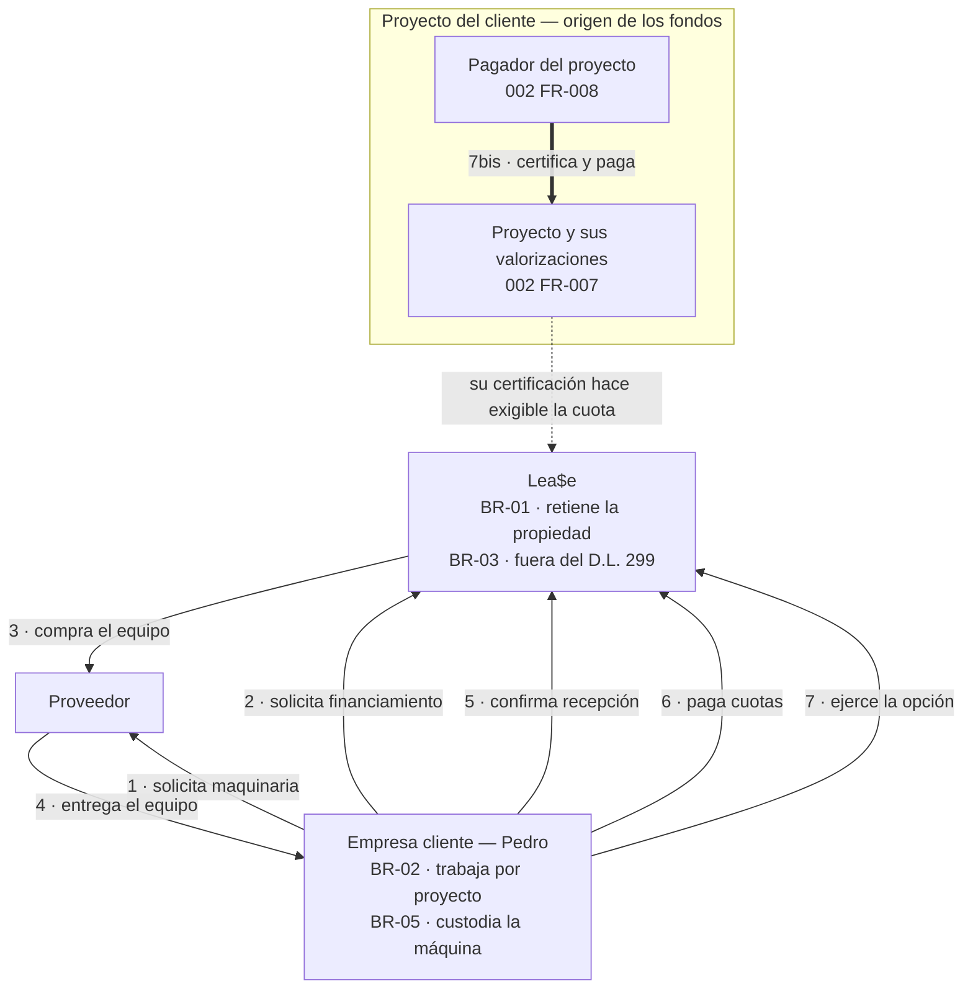
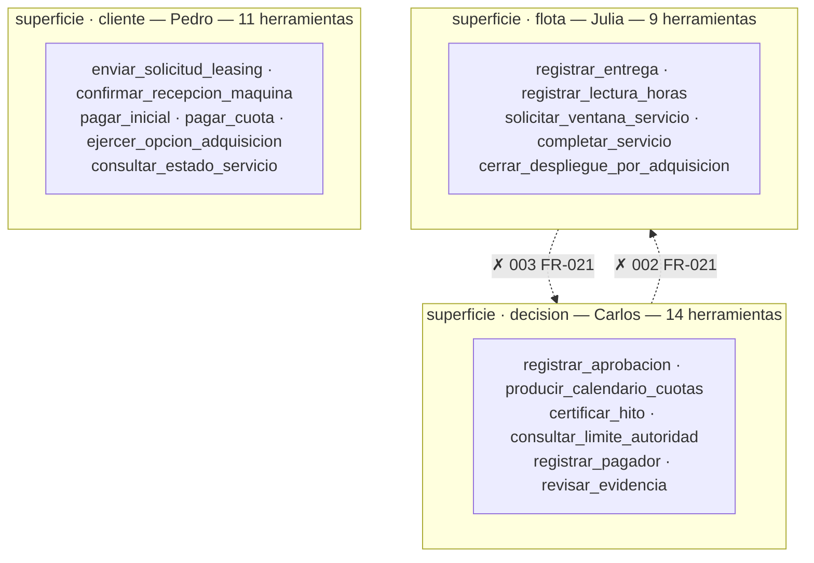
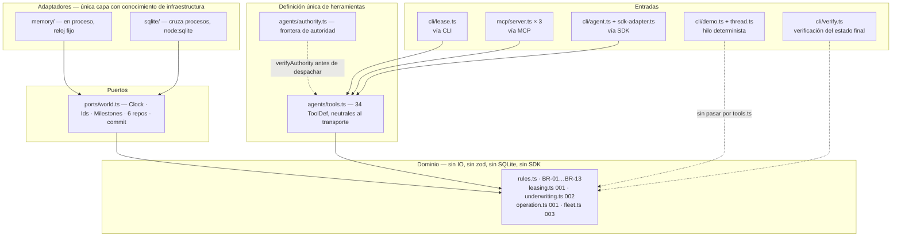
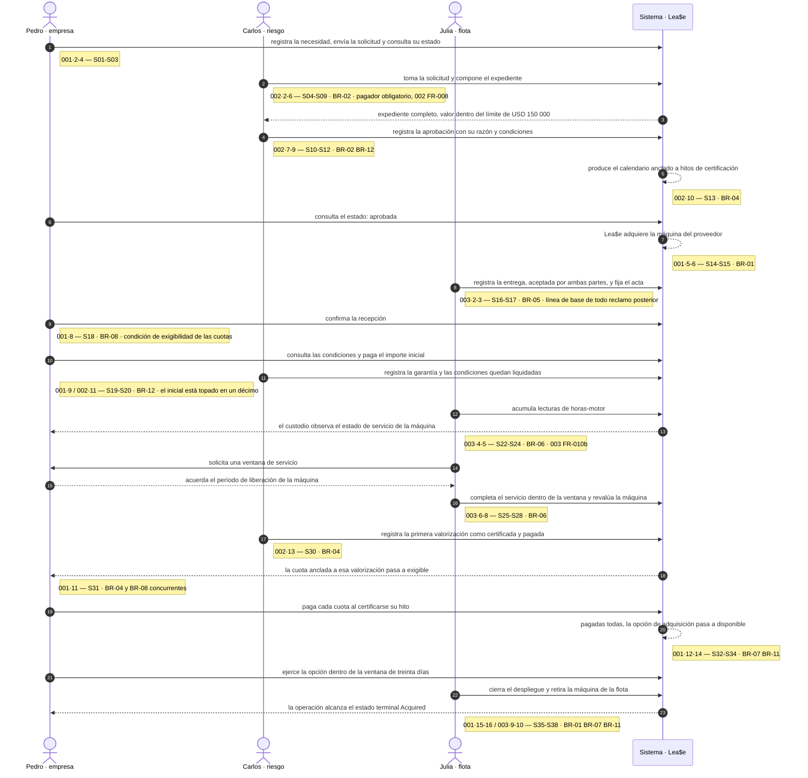

# Arquitectura — Lea$e

El presente documento describe la arquitectura del sistema en cuatro vistas complementarias. Cada
una delimita un aspecto distinto y no reitera lo afirmado por las restantes.

| Vista | Objeto |
|---|---|
| [V1 · Contexto de negocio](#v1--contexto-de-negocio) | Actores externos del sistema y flujos entre ellos |
| [V2 · Frontera de autoridad](#v2--frontera-de-autoridad) | Distribución de capacidades por actor y cruces prohibidos |
| [V3 · Capas y transportes](#v3--capas-y-transportes) | Estructura del código y dirección de sus dependencias |
| [V4 · Recorrido de Stage 1](#v4--recorrido-de-stage-1) | Secuencia del recorrido implementado |

## Objeto y delimitación

Este documento afirma dónde se sitúan las fronteras del sistema y en qué fundamento se apoyan.

No redefine reglas de negocio, que cita a [`business-rules.md`](../business-rules.md); no establece
qué hace el sistema, atribución exclusiva de [`specs/`](../specs/) conforme al Principio IV; y no
documenta la ejecución del POC, materia de [`poc/README.md`](../poc/README.md).

Constituye el *design record* que el Principio I designa sin asignarle ubicación:

> *No architecture decision, component boundary, diagram, or line of POC code may be produced before
> the requirement it serves exists in the spec chain.* […] *A queue, a cloud product, or a topology
> named inside a requirement is a design decision in disguise: it is moved to the **design record**,
> not deleted.*

De dicho principio se deriva la regla de redacción que el documento observa: todo componente y toda
relación representados citan el requisito funcional (`FR-nnn`) o la regla de negocio (`BR-nn`) que
los origina. Un elemento sin cita constituye un defecto. El
[procedimiento de verificación](#procedimiento-de-verificación) permite comprobarlo.

---

## V1 · Contexto de negocio

El enunciado incorpora dos diagramas
([1](lab-02-diagram-1-request-purchase.png), [2](lab-02-diagram-2-delivery-payment-acquisition.png))
con tres actores y seis relaciones. La vista las recoge y añade una séptima que aquéllos no
representan.



| # | Relación | Contenido | Fundamento |
|---|---|---|---|
| 1 | Empresa → Proveedor | solicita maquinaria | `001` FR-001 |
| 2 | Empresa → Lea$e | solicita financiamiento | `001` FR-002 |
| 3 | Lea$e → Proveedor | compra el equipo y retiene su propiedad | BR-01 |
| 4 | Proveedor → Empresa | entrega el equipo | `003` FR-001 · BR-05 |
| 5 | Empresa → Lea$e | confirma recepción | `001` FR-008 · BR-08 |
| 6 | Empresa → Lea$e | paga cuotas | `001` FR-012 · BR-04 |
| 7 | Empresa → Lea$e | ejerce la opción una vez pagadas todas las cuotas | `001` FR-017 · BR-07 |
| 7bis | Pagador → Proyecto | certifica y paga la valorización | BR-04 · `002` FR-007, FR-008 |
| — | Proyecto ⇢ Lea$e | la certificación del hito hace exigible la cuota anclada a él | `002` FR-014 · `001` FR-010b |

### Dependencia del pagador del proyecto

Las siete primeras relaciones proceden del enunciado. La 7bis no consta en él y constituye el aporte
de esta vista.

Puesto que las cuotas vencen contra la certificación del proyecto (BR-04), la capacidad de repago no
depende del solicitante sino del agente que le paga. `002` FR-008 exige nombrarlo aun cuando su
comportamiento de pago se registre como desconocido; un pagador sin nombrar impide la decisión. La
persona [`Carlos.MD`](../personas/Carlos.MD) formula la misma condición: *«He is underwriting two
companies and only has a file on one»*.

La omisión de esta relación priva a BR-04 de fundamento y reduce el sistema a la administración de
contratos que el Principio III excluye, esto es, un sistema que no interviene sobre la causa por la
que el cliente no puede financiar el equipo por adelantado.

### Naturaleza de BR-03

BR-03 constituye una restricción sobre la forma del contrato, no una integración con terceros. Lea$e
no es banco, financiera, cooperativa registrada ni empresa inscrita en el registro SBS de
arrendamiento, por lo que el régimen del D.L. 299 le resulta inaplicable. Ello no impide que un
arrendamiento comercial concluya en adquisición, que es estipulación civil. La regla figura en el
catálogo y no entre las que el código ejerce, dado que determina el régimen de contratación y no un
comportamiento del sistema.

---

## V2 · Frontera de autoridad

La separación de funciones constituye un invariante verificado por la integración continua en cada
push, y no una convención documental.



| Cruce | Capacidades excluidas | Fundamento |
|---|---|---|
| Carlos → `flota` | `registrar_entrega`, `cerrar_despliegue_por_adquisicion`. Decidir el préstamo y ejecutarlo no pueden corresponder a la misma persona | `002` FR-021 |
| Julia → `decision` | `registrar_aprobacion`, `pagar_cuota`. Ejecuta sobre la máquina y no determina el incumplimiento del cliente | `003` FR-021 |

La superficie `cliente` no interviene en ninguno de los cruces prohibidos, por no constituir una
superficie de Lea$e. La frontera que las especificaciones establecen es interna a la empresa y separa
la decisión de la ejecución.

### Correspondencia en tres capas

| Capa | Mecanismo | Ubicación |
|---|---|---|
| Dominio | Se cumple por ausencia: `underwriting.ts` no exporta operación alguna sobre la flota, ni `fleet.ts` sobre la decisión | [`poc/src/domain/`](../poc/src/domain/) |
| Actores | `SURFACE_OF_ACTOR` asigna exactamente una superficie a cada actor | [`authority.ts`](../poc/src/agents/authority.ts) |
| Herramientas | El acotamiento reside en el binario: `mcp/server.ts` publica únicamente `TOOLS[actor]` y `lease.ts` no reconoce herramientas ajenas | [`mcp/server.ts`](../poc/src/mcp/server.ts) |

`npm run agent:matrix` emite la matriz de autoridad y falla si la frontera no se sostiene. Se trata
de una comprobación estructural sobre datos, que no requiere credenciales ni acceso a la red.
`npm run mcp:smoke` inicia los tres servidores y verifica que cada uno sirva exclusivamente su
superficie.

### Criterio de asignación de superficie

`consultar_estado_servicio` pertenece a la superficie `cliente` y no a `flota`. `003` FR-010b
requiere que el estado `Service Due` sea observable por el custodio, que se sitúa del lado del
cliente.

El criterio de asignación es la naturaleza del acto y no el actor al que la herramienta se refiere.
La herramienta consulta el estado de una máquina que la empresa mantiene en custodia y no ejecuta
operación alguna sobre la flota: no incorpora máquinas, no entrega, no acuerda ventanas de servicio
ni cierra despliegues. Dichos actos permanecen en la superficie `flota`.

### Naturaleza de la frontera

La frontera es de diseño y no de seguridad: cualquier proceso con acceso a `Bash` puede importar el
dominio directamente. Su función consiste en denegar la operación citando el requisito que la
prohíbe:

```
$ npm run lease -- carlos registrar_entrega
registrar_entrega es una herramienta de Julia, no de Carlos.
  002 FR-021 — decidir prestar y prestar no pueden ser el acto de la misma persona
```

El campo `tools:` del frontmatter de los subagentes en `.claude/agents/` opera como refuerzo y no
como mecanismo: la garantía no depende de que el entorno de ejecución respete una lista de permitidos.

---

## V3 · Capas y transportes

Arquitectura hexagonal. Toda arista representa una relación de importación, y ninguna procede del
dominio hacia el exterior.



### Entradas al dominio

[`poc/README.md`](../poc/README.md) describe tres transportes sobre una definición única de
herramientas. El sistema presenta cinco entradas, dos de las cuales no atraviesan `tools.ts`.

| Entrada | Vía `tools.ts` | Mundo | Requiere credencial |
|---|---|---|---|
| `cli/lease.ts` — CLI | sí | SQLite, uno por proceso | no |
| `mcp/server.ts` ×3 — MCP | sí | SQLite, uno por llamada | no |
| `cli/agent.ts` — SDK | sí, mediante `sdk-adapter.ts` | memoria, en proceso | sí |
| `cli/demo.ts` + `thread.ts` | no: invoca el dominio directamente | memoria, reloj fijo | no |
| `cli/verify.ts` | no: acceso de solo lectura | SQLite, proceso independiente | no |

La cuarta entrada constituye la vía determinista del entregable: se ejecuta sin acceso a la red y su
transcripción, versionada en [`poc/evidence/run.txt`](../poc/evidence/run.txt), es comparada byte a
byte por la integración continua.

### Provisión del World a las herramientas

`ToolDef.run` recibe el `World` como parámetro en lugar de capturarlo por clausura. Esta decisión
permite que un servidor MCP abra una instancia por llamada, opere y confirme, de modo que la misma
definición sirve tanto a un proceso de vida larga como a uno de invocación única sin bifurcarse.

### Ubicación de Milestones en World

Los hitos de certificación atraviesan agregados y procesos: `002` los crea al registrar el proyecto y
los certifica conforme avanza la obra, y `001` los consulta para determinar la exigibilidad de una
cuota (BR-04). Al ejecutarse tres servidores MCP como procesos independientes, los hitos requieren
tratamiento de estado compartido, razón por la que se sitúan en `World` y no entre los repositorios.

### Estado compartido

El estado compartido entre agentes reside en el dominio y no en la conversación. Cada turno inicia
con contexto vacío y obtiene el estado consultando al mundo. En consecuencia, el recorrido atraviesa
los tres agentes sin que ninguno arrastre el historial de los demás, y el costo no crece en función
de su extensión.

### Evolución de la persistencia

El almacén SQLite conserva el estado completo como un documento en una única fila. Constituye un
almacén de prueba de concepto y no un modelo de datos. La incorporación de Postgres o Neon se
resuelve mediante un adaptador adicional tras `ports/world.ts`, sin modificación del dominio ni del
hilo determinista. Esta propiedad es la finalidad de la costura y la que distingue el diseño de una
aplicación de gestión genérica.

---

## V4 · Recorrido de Stage 1

Los `Stage 1` de las tres especificaciones no constituyen tres entregas independientes sino un único
recorrido: lo que `001` declara fuera de alcance es precisamente lo que `002` y `003` producen.



Resultado de la ejecución: 38 pasos declarados, 38 ejecutados, ninguno pendiente ni fallido, con 9 de
9 reglas ejercidas.

### Guardas de dominio

Dos rechazos determinan el diseño:

- `payInstalment` rechaza el pago de una cuota sin recepción confirmada (BR-08) o sin hito
  certificado (BR-04).
- `exerciseAcquisitionOption` rechaza el ejercicio de la opción con cuotas pendientes (BR-07) o fuera
  del plazo de treinta días (BR-11).

Ambas validaciones residen en el código y no en las instrucciones del agente. En consecuencia, una
respuesta errónea del modelo no puede infringir una regla de negocio.

### Verificabilidad de D4

D4 exige que la primera etapa del alcance corresponda exactamente al recorrido que el POC construye.
La fuente de esta vista no es la especificación sino
[`poc/evidence/run.txt`](../poc/evidence/run.txt), la transcripción versionada de la ejecución.

`npm run citations -- --check` verifica dicha correspondencia en tres extremos: que el paso citado
exista, que su texto coincida con el registrado en el último snapshot versionado, y que ningún paso
de Stage 1 quede sin cubrir sin declaración expresa. El guardián se incorporó tras detectarse que la
inserción de dos pasos en `001` dejó seis citas apuntando a pasos incorrectos sin que la integración
continua lo advirtiera.

### Cobertura de reglas en Stage 1

`STAGE_1_RULES` comprende nueve reglas: BR-01, BR-02, BR-04, BR-05, BR-06, BR-07, BR-08, BR-11 y
BR-12. Las cuatro restantes quedan excluidas conforme a lo que las propias especificaciones
establecen: BR-03 no produce comportamiento; BR-09 y BR-10 rigen el incumplimiento y la parada por
seguridad, supuestos que ningún Stage 1 contempla; y de BR-13 el recorrido ejerce el dato —el
`Assessed Value`— pero no su invariante, dado que `003` excluye el deterioro de forma expresa.

---

## Procedimiento de verificación

La correspondencia entre este documento y el sistema se verifica por ejecución.

```sh
cd poc && npm ci

npm run agent:matrix           # V2 — emite la frontera y falla si no se sostiene
npm run demo                   # V4 — 38/38 pasos, 9/9 reglas
npm run mcp:smoke              # V3 — los tres servidores sirven su superficie y comparten el mundo
npm run e2e                    # V3 y V4 — Stage 1 por CLI y estado final afirmado regla por regla
npm run citations -- --check   # V4 — vigencia de las citas a Stage 1
```

Comprobación documental:

| Objeto | Criterio |
|---|---|
| Reglas citadas | Toda `BR-nn` figura en [`business-rules.md`](../business-rules.md) |
| Requisitos citados | Todo `00n FR-mmm` figura en `specs/00n-*/spec.md` |
| Identificadores de herramienta | Todo nombre en `snake_case` figura en [`authority.ts`](../poc/src/agents/authority.ts) |
| Conteos por superficie | 11 · 14 · 9 = 34, enumerados por `npm run agent:matrix` |
| Cruces prohibidos | Coinciden con `FORBIDDEN_CROSSINGS` |

Toda vista que deje de corresponder al código es detectada por el comando indicado en su fila.
